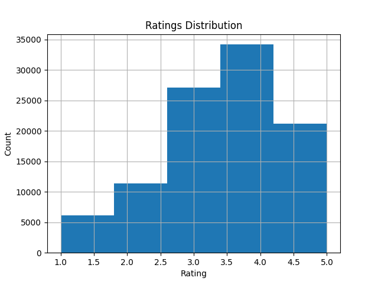

# Hybrid Movie Recommendation System


A comprehensive implementation of a hybrid movie recommendation system that combines collaborative filtering and content-based filtering techniques to provide personalized movie suggestions. This project explores multiple recommendation strategies and evaluates their performance on the classic MovieLens 100k dataset.



## 🌟 Key Features

- **Multiple Models:** Implements three distinct recommendation approaches:
    1.  **Collaborative Filtering:** Using Singular Value Decomposition (SVD) to model user-item interactions.
    2.  **Content-Based Filtering:** Using TF-IDF and Cosine Similarity on movie genres to find similar items.
    3.  **Hybrid System:** A weighted combination of SVD and Content-Based models to leverage the strengths of both.
- **In-depth Evaluation:** Assesses model performance using industry-standard metrics, including Root Mean Square Error (RMSE) for rating prediction and Precision@K/Recall@K for ranking quality.
- **Modular Codebase:** The project is structured with modular, reusable functions for data loading, model training, and evaluation, making it easy to understand and extend.

## 🛠️ Methodology

### 1. Collaborative Filtering (SVD)
This model is based on Matrix Factorization, which uncovers latent factors in the user-item rating matrix. The SVD algorithm from the `surprise` library is used to predict a user's rating for a movie they haven't seen yet.

### 2. Content-Based Filtering
This model recommends items based on their properties. Movie genres were vectorized using TF-IDF, and a Cosine Similarity matrix was computed to find movies with similar genre profiles. This helps solve the "cold start" problem for new users.

### 3. Hybrid Recommender
The final model combines the outputs of the two models above. The final score for a recommendation is a weighted average:

`Final Score = (α * SVD_Score) + ((1 - α) * Content_Score)`

This allows for a balance between the "wisdom of the crowd" (collaborative) and item-specific properties (content-based).

## 📊 Dataset

This project uses the **MovieLens 100k Dataset**, which contains 100,000 ratings from 943 users on 1,682 movies. You can find the dataset [here](https://grouplens.org/datasets/movielens/100k/).


### Codes


-   **`matrix_factorization.py`**: Implements the SVD-based collaborative filtering model using the `surprise` library and calculates its RMSE.
-   **`content_based.py`**: Builds the content-based model using TF-IDF on movie genres and computes a cosine similarity matrix.
-   **`item_item_cf.py`**: An implementation of a classic item-item collaborative filtering model, serving as an alternative baseline model.
-   **`hybrid_recommender.py`**: Contains the core logic for the hybrid system, combining scores from the SVD and content-based models to generate the final recommendations.


The main script to run the full training and evaluation pipeline is `evaluate_hybrid.py`.

```bash
python src/evaluate_hybrid.py
```
This script will:
1.  Load the dataset.
2.  Train the SVD model and report its RMSE.
3.  Build the content-based similarity matrix.
4.  Loop through all users to generate hybrid recommendations.
5.  Calculate and print the final average Precision@10 and Recall@10 for the hybrid model.

## 📈 Evaluation Results

The hybrid model was evaluated on its ability to predict movies a user would rate highly (4 or 5 stars).

| Metric | Score | Description |
| :--- | :--- | :--- |
| **RMSE (SVD)** | `0.9396` | The model's rating predictions are, on average, off by only 0.94 stars on a 5-star scale. |
| **Average Precision@10** | `0.3232` | On average, **32.3%** of the top 10 recommended items were relevant hits, indicating high quality recommendations. |
| **Average Recall@10**| `0.0620` | The model successfully found **6.2%** of all relevant items for a user within its top 10 list. |

These results demonstrate a well-performing system that accurately predicts ratings and excels at ranking highly relevant items at the top of its recommendation lists.


## 📜 License
This project is licensed under the MIT License.


